# Instrucciones para clonar el repositorio
1. Obtener la URL del repositorio en GitHub (https://github.com/Moises5970/products-and-users---REST-API.git).
2. En la terminal ejecutamos*git clone* seguido de la URL.
3. Entramos a la carpeta por medio de cd
4. verificamos el estado con *git status* el resultado debe de ser similar a este:
    On branch main
    Your branch is up to date with 'origin/main'
6. Apartir de ahi se realiza los commit de la misma manera, cabe aclarar que solo los dejara si tienes acceso.

# Configuración del entorno
1. En la terminal ejecutamos los siguientes comandos:
    - npm init -y
    - npm i express mongodb dotenv  
    - npm i -D nodemon
2. Se agregan scripts de automatización en el archivo package.json.
En la sección "scripts" se añaden los comandos:
    "dev": "nodemon src/server.js", 
    "start": "node src/server.js"
Sustituimos el *"type": "commonjs"* por *"type": "module"*
3. 

# Modelos y Validaciones de BD

Para esta API, se implementó la validación de esquemas nativos de MongoDB utilizando `$jsonSchema` utilizando el driver oficial.

* **Usuarios** *Campos Obligatorios: `nombre`, `email`, `rol`.
  * Validación estricta de formato de correo electronico mediante las expresiones regulares.
  * Restricción de valores para el campo del `rol` permiriendo solo dos tipo 'admin' o 'cliente'

* **Productos:**
  * Campos obligatorios: `nombre`, `precio`, `categoria`.
  * Restricciones: Se prohíbe el insertar de valores negativos en los campos `precio` y `stock`.
  * Relaciones: Implementación de referencia guardando el `ObjectId` del usuario en el campo `creadoPor`.

* **Ventas:**
  * Campos obligatorios: `productoId`, `cantidad`, `total`.
  * Relación: Enlace con el documento de la colección de productos mediante `ObjectId`.
  * Reglas de negocio: La `cantidad` mínima de venta es 1 y el `total` no puede ser un valor negativo.


# Rutas
### Usuarios

```
http://localhost:3000/usuarios
```

#### POST

Crear/registrar usuarios.

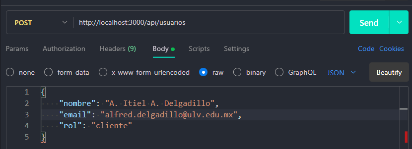

#### GET

Obtener los usuarios registrados.

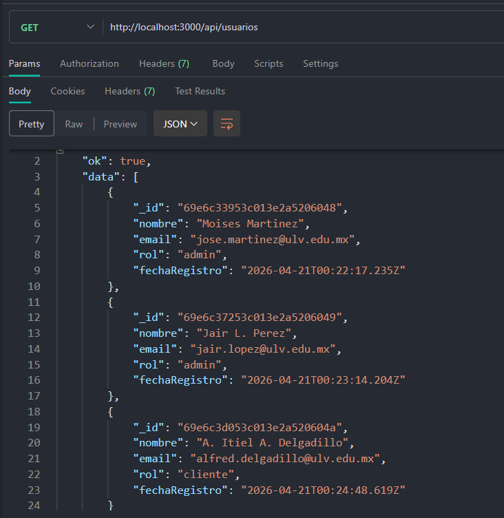

#### GET /:id

Obtener un usuario en especifico.

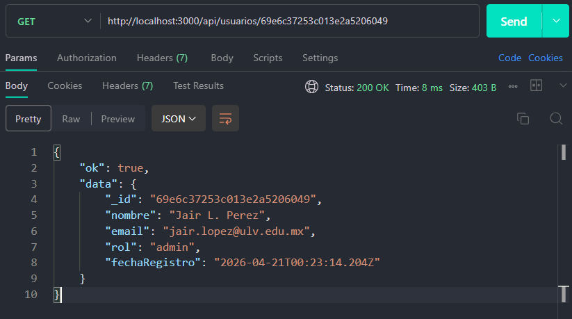

#### PUT /:id

Actualizar un usuario.
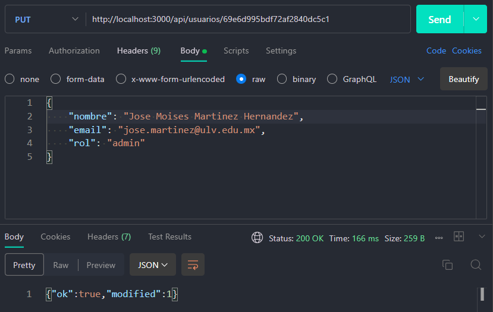

#### DELETE /:id

Eliminar un usuario.
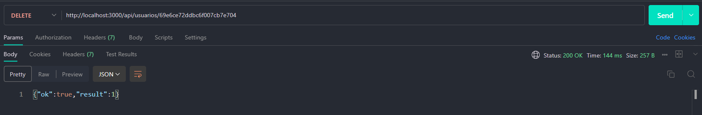


### Productos

```
http://localhost:3000/productos
```

#### POST

Crear/registrar productos.


Se requiere el ID para identificar quien esta registrando el producto.

#### GET

Obtener los productos registrados.
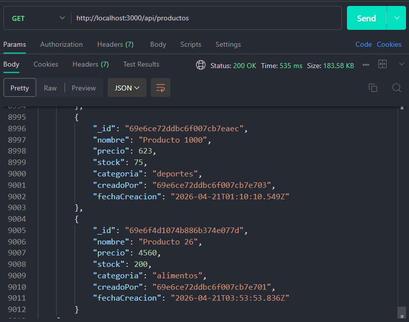

#### GET /:id

Obtener un producto en especifico.
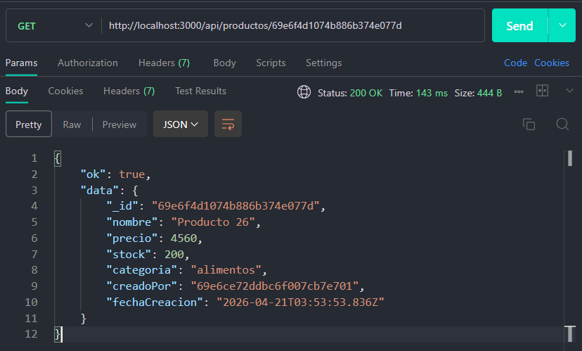

#### PUT /:id

Actualizar un producto.
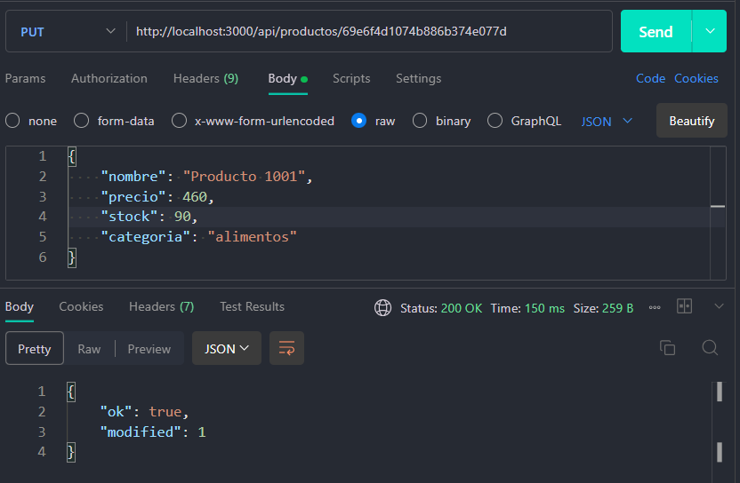

#### DELETE /:id

Eliminar un producto.
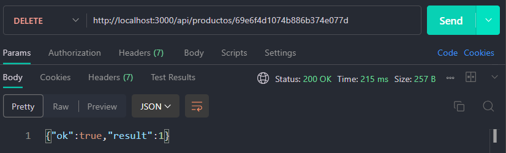

### Ventas

```
http://localhost:3000/ventas
```

#### POST
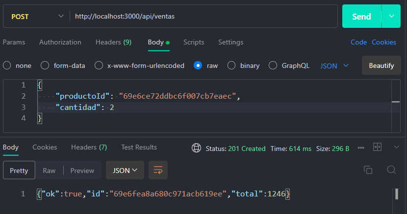
En este caso se ingresa el ID por medio de body, que es otra forma de solicitarlo, ademas nos retorna el tortal a pagar de la venta.

#### GET
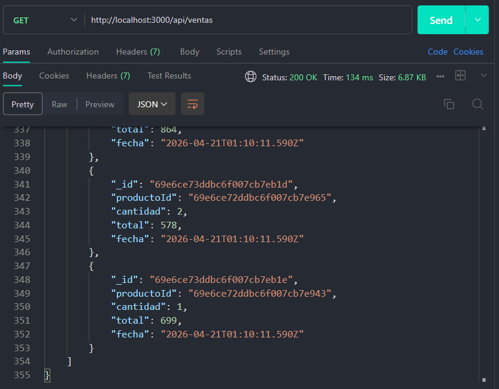

#### DELETE /:id
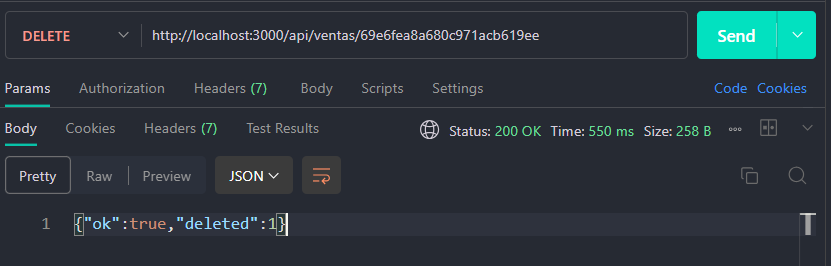

#### Consultas avanzadas con agregaciones

Suma del total de ventas y de la cantidad de productos vendidos.
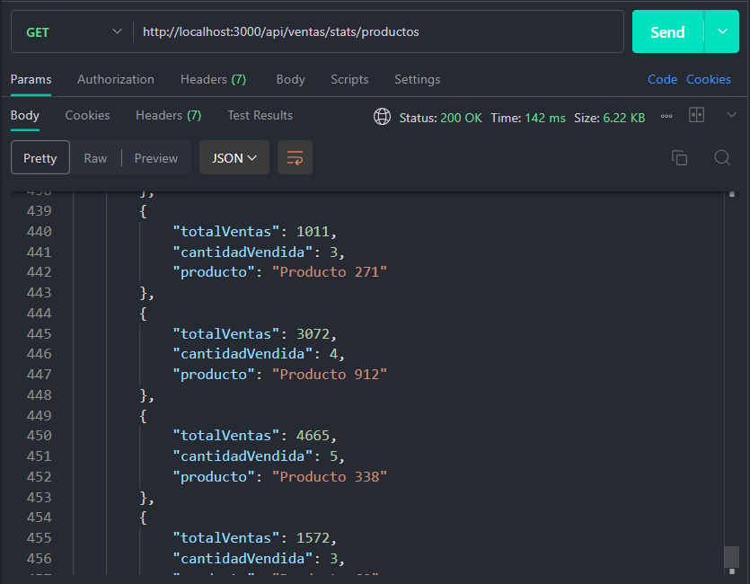

Cantidad de productos por categoria.
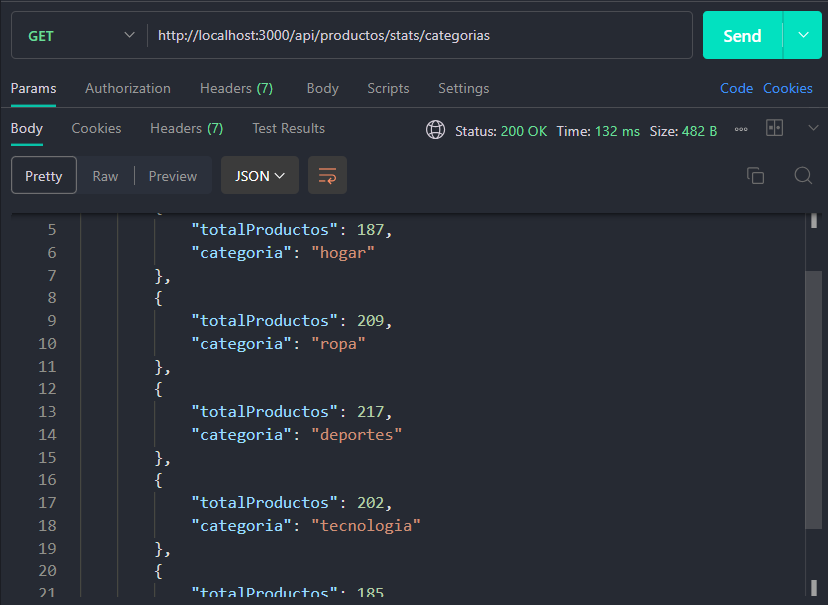